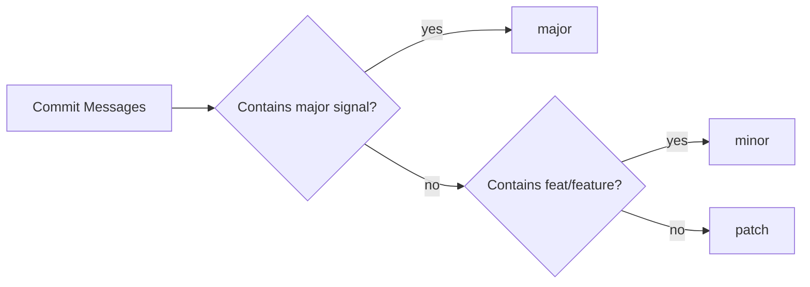

# Auto Git Push + README Version Update

This project now includes two automations:

1. Auto README semantic version bumping on push/build.
2. A Python helper that generates copy-paste git push commands and can also run one-click auto push.

## What it does

- Maintains `x.y.z` version in `README.md` under a `Version Status` block.
- Chooses bump level from pushed commit messages:
  - `major`: `BREAKING CHANGE`, `major:`, or Conventional Commit `!`
  - `minor`: `feat:` or `feature:`
  - `patch`: default fallback
- Updates:
  - `README.md` (Current Version, Last Bump, Last Updated)
  - `docs/version-history.md` (append release entry)
- Commits and pushes the version update automatically via GitHub Actions.

## Architecture graph

```mermaid
flowchart TD
  A[Push to main/master] --> B[GitHub Action starts]
  B --> C[Read push commit messages]
  C --> D{Bump level?}
  D -->|BREAKING / major / !| E[major x+1.0.0]
  D -->|feat / feature| F[minor y+1.0]
  D -->|default| G[patch z+1]
  E --> H[Update README Version Status]
  F --> H
  G --> H
  H --> I[Append docs/version-history.md]
  I --> J[Commit chore(version)]
  J --> K[Push updated metadata]
```

## Bump decision graph



## Files

- `auto-readme-version-skill.md`
- `auto-readme-version-workflow.md`
- `auto-git-push-skill.md`
- `auto-git-push-workflow.md`
- `scripts/auto_readme_version.py`
- `auto_git_push.py`
- `.github/workflows/auto-readme-version.yml`

## Trigger behavior

- Runs on push.
- Runs manually with workflow dispatch.
- Prevents infinite loops by skipping runs from `github-actions[bot]` and ignoring push events where only `README.md` and `docs/version-history.md` changed.

## Real examples

### Example 1: major bump

Commit message:

```text
feat(api)!: switch auth token format
BREAKING CHANGE: old JWT claims removed
```

Version result:

```text
v2.4.9 -> v3.0.0
```

### Example 2: minor bump

Commit message:

```text
feat: add release dashboard endpoint
```

Version result:

```text
v3.0.0 -> v3.1.0
```

### Example 3: patch bump

Commit message:

```text
docs: fix README typos
```

Version result:

```text
v3.1.0 -> v3.1.1
```

## README update example

Before:

```markdown
## Version Status
- Current Version: v1.2.3
- Last Bump: minor
- Last Updated: 2026-03-19 12:00:00Z
```

After (patch run):

```markdown
## Version Status
- Current Version: v1.2.4
- Last Bump: patch
- Last Updated: 2026-03-19 16:00:00Z
```

## Version rules

- `x` (major): breaking/high-impact changes.
- `y` (minor): new non-breaking features.
- `z` (patch): fixes/docs/chore/minor updates.

## Manual local run

```bash
python scripts/auto_readme_version.py --repo .
```

## Auto git push helper

Generate command for copy/paste:

```bash
python auto_git_push.py --repo .
```

Generate and auto copy to clipboard (Windows):

```bash
python auto_git_push.py --repo . --copy
```

One-click terminal auto push:

```bash
python auto_git_push.py --repo . --message "chore: update" --auto
```

GUI mode (button click to auto push):

```bash
python auto_git_push.py --repo . --gui
```

## Optional install targets

If you want to reuse this as a portable skill/workflow package:

- OpenCode skill: `~/.config/opencode/skills/auto-readme-version/SKILL.md`
- Claude skill: `~/.claude/skills/auto-readme-version/SKILL.md`
- Codex skill: `~/.codex/skills/auto-readme-version/SKILL.md`
- Antigravity workflow: `~/.gemini/antigravity/global_workflows/auto-readme-version.md`
- Gemini command: `~/.gemini/commands/auto-readme-version.md`

## Version Status

- Current Version: v0.0.1
- Last Bump: patch
- Last Updated: 2026-03-19 15:45:56Z

